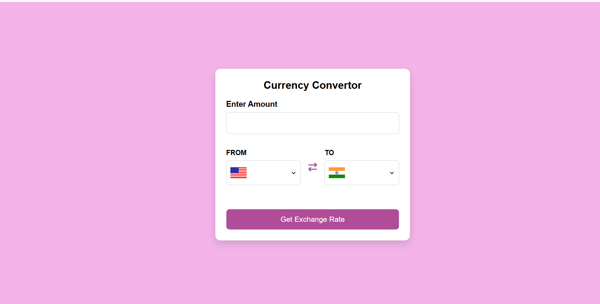
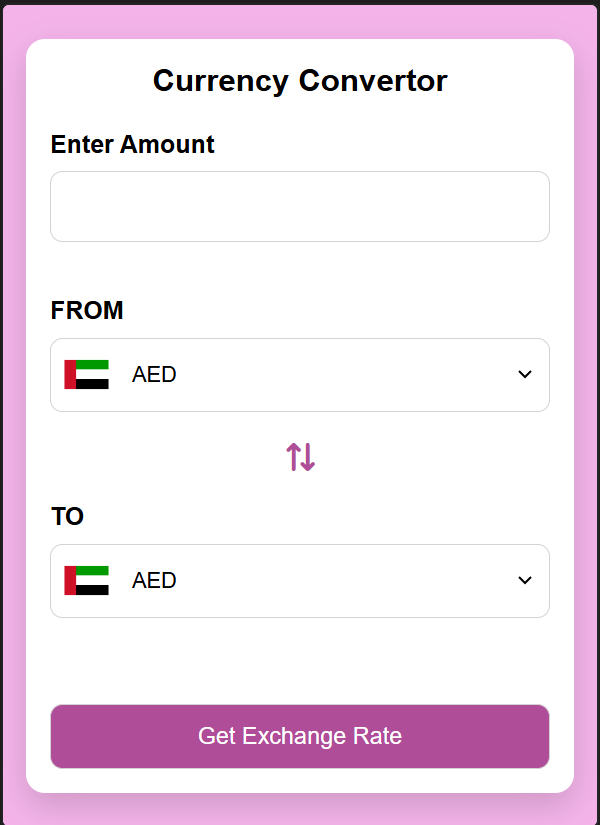
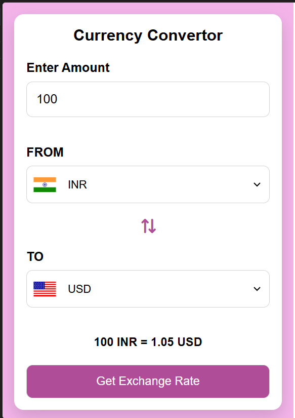

# 💱 Currency Converter

A responsive Currency Converter web application built using **HTML**, **CSS**, and **JavaScript**. The application allows users to convert one currency to another using real-time exchange rates fetched from an external API.

---

## 🚀 Features

- Convert between multiple international currencies
- Real-time exchange rate updates
- User-friendly and responsive interface
- Swap currencies easily
- Input validation and error handling

---

## 🛠️ Technologies Used

- HTML5
- CSS3
- JavaScript (ES6)
- Exchange Rate API

---

## 📂 Project Structure

```
currency-converter
│── index.html
│── style.css
│── script.js
│── images/
└── README.md
```

---

## ▶️ How to Run the Project

1. Download or clone the repository.
2. Open the project folder.
3. Open `index.html` in your browser.

No additional installation is required.

---

## 📸 Screenshots

### Home Page



### Currency Converter



### Result



---

## 📌 Future Improvements

- Dark Mode
- Searchable currency list
- Currency conversion history
- Favorite currencies
- Improved UI animations

---

## 👨‍💻 Author

**Nirav Rana**
